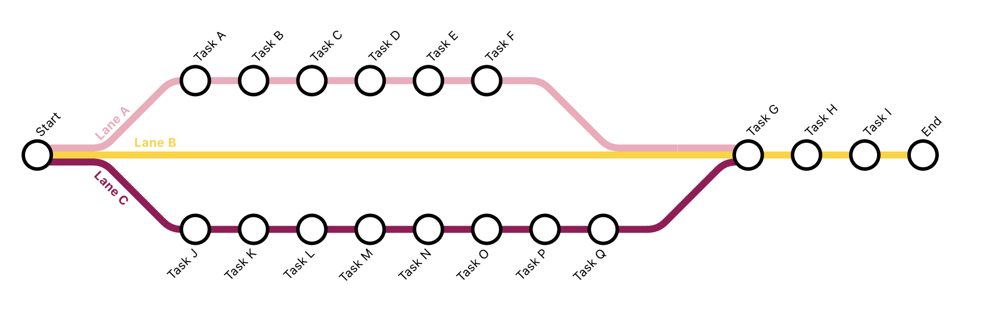

# Tube Map

This was created to meet a need of drawing data driven process diagrams.  I wanted to use Harry Beck's classic [London Underground](https://tfl.gov.uk/corporate/about-tfl/culture-and-heritage/art-and-design/harry-becks-tube-map) map as an inspiration for the layout.

I attempted to follow as much of the TFL line diagram standards as possible: https://content.tfl.gov.uk/tfl-line-diagram-standard.pdf

## Example



This example is included in the code.

## How to use

The tool is designed to draw diagrams from left to right only, and it expects a single starting point.

The tool expects a data structure containing two items, the `branches` of the process and the `milestones`.  Each should be an object. 

```{javascript}
const data = {
  branches: {},
  milestones: {}
}
```

### Branches

The branches object should contain one or more objects, each of which defines a a process branch.  For example

```{javascript}
const data = {
  branches: {
    brancha: {},
    branchb: {}
  }
}
```

Each branch should be defined as follows:

```{javascript}
{
  name: "Name of the branch",
  seq: "",
  colour: ""
}
```

| Property | Purpose |
|--|--|
|`name`| Name of the branch, which is displayed on the diagram|
|`seq`| The sequence of lines and milestones|
|`colour`| What colour should the process branch, can be a hex colour e.g. #ff0000 or a standard colour name e.g. red|

`seq` should be a comma-separated string containing the instructions to draw the process branch.  Each comma-separated substring should conform to the following scheme:

|Substring|Purpose|
|--|--|
|`-`|Draw a straight line|
|`/`|Draw an upward branch|
|`\`|Draw a downward branch|
|`$`|End the process|
|`string`|Draw a milestone with details defined in milestone object under key `string`|

### Milestones

Each of the milestones referenced in the sequences should be defined in the `milestones` object.  Each milestone should have a name and optionally a colour as follows:

```{javascript}
const data = {
  branches: {},
  milestones: {
    milestone1: {
      name: "Start of the process",
      colour: "red"
    }
  }
}
```

The `colour` attribute is optional and if not present the default colour is white

## Including it in your app
After defining your data object, including the tube-map is quite easy:

```{javascript}
import Map from './Map';

// in your render method:
return (
  <Map 
    data={data}
    debug={false}
    dimensions={{
      width: 1000, height: 400,
      margin: { top: 0, right: 30, bottom: 30, left: 0 }
    }}
  />
)
```

## Acknowledgements 

This project was bootstrapped with [Create React App](https://github.com/facebook/create-react-app).